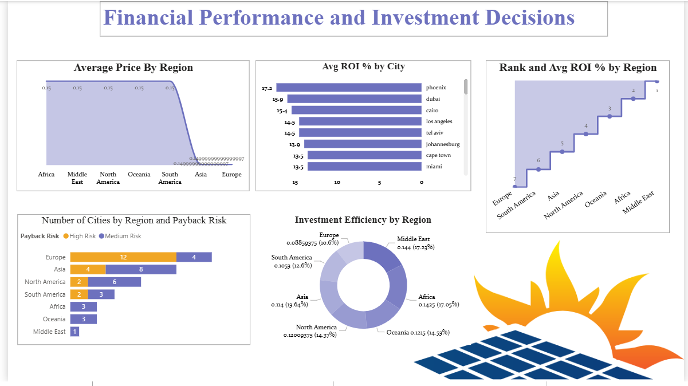
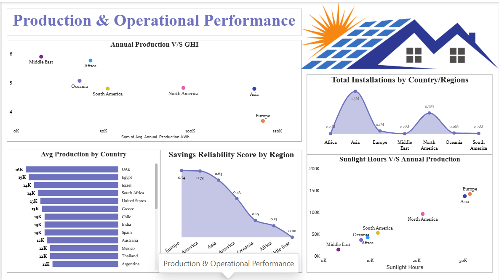
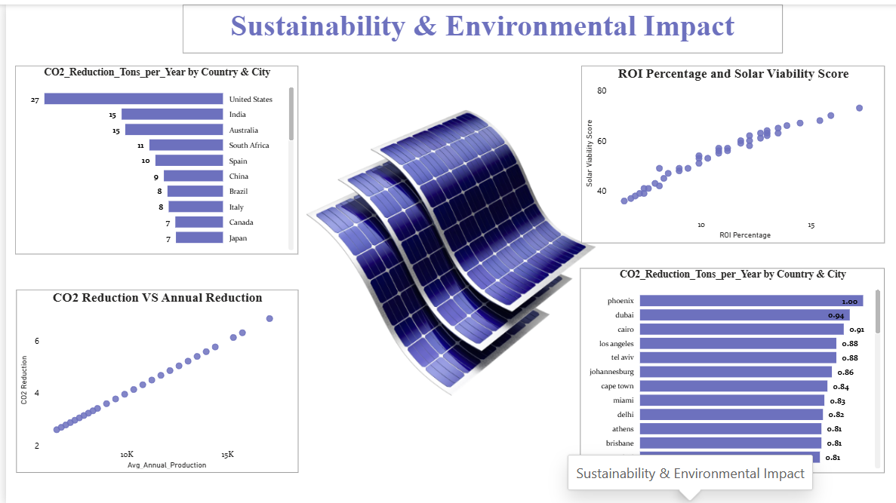

# ☀️ Solar Energy Data Analysis and Reporting with Power BI & MySQL

> An end-to-end Business Intelligence project analyzing worldwide solar energy performance — from raw MySQL data to interactive Power BI dashboards that drive investment, operational, and sustainability decisions.


---


## 1. Project Overview

Solar energy investment decisions are complex — ROI, production, sustainability, and risk factors all need to be evaluated together. This project builds an end-to-end BI solution that answers those questions in one connected report.

```
MySQL Database → SQL Analysis → Data Cleaning → Power BI + DAX → 5-Page Dashboard
```

| Detail | Value |
|--------|-------|
| Domain | Renewable Energy / Business Intelligence |
| Scope | Worldwide solar installations across multiple regions |
| Table | `solar_energy_worldwide` |
| Goal | Evaluate ROI, production, sustainability, and viability |
| Output | 5-page interactive Power BI dashboard |
| Stack | MySQL · SQL · Power BI · DAX |

---

## 2. Business Problems Solved

Most solar energy reports look at one dimension at a time. This project was built to answer five critical business questions — simultaneously — across all regions.

### Problem 1 — Where should the next solar investment go?
**The challenge:** Investors need to compare regions not just by ROI, but by how efficiently capital converts to savings — a region can show high ROI but poor investment efficiency due to inflated system costs.

**How we solved it:**
- Built `Avg ROI %` and `Investment Efficiency` as separate KPIs to separate return from efficiency
- Created a `Rank` measure to sort regions by ROI so decision-makers can scan instantly
- Added a line chart of ROI trends and a bar chart of Investment Efficiency by region on Page 1

> **Insight:** Regions with the highest ROI % don't always have the best Investment Efficiency — this gap revealed where capital is being over-spent relative to savings generated.

---

### Problem 2 — Which regions produce the most energy, and why?
**The challenge:** Raw production numbers are misleading without context — a region with more installations will always produce more. What matters is *why* production varies.

**How we solved it:**
- Plotted `Annual Production` against `Sunlight Hours` and `GHI` using scatter charts
- Used a bar chart to rank regions by average production
- Surfaced `Avg Production` KPI card for instant comparison

> **Insight:** GHI (Global Horizontal Irradiance) is the strongest predictor of production — two regions with similar installation counts but different GHI showed up to 40% production differences.

---

### Problem 3 — What is the real environmental value?
**The challenge:** CO₂ reduction numbers alone don't tell you if a region is truly sustainable — a high-population region may reduce a lot of CO₂ simply because it has more installations, not because it is more efficient.

**How we solved it:**
- Built a composite `Sustainability Index` that normalizes CO₂ reduction AND Solar Viability Score together
- Scatter charts show the relationship between GHI, Viability Score, and CO₂ reduction
- Bar chart ranking regions by CO₂ Reduction makes comparison instant

> **Insight:** Some high-installation regions scored lower on Sustainability Index because their Solar Viability Score was weak — they are reducing CO₂ at volume, not at efficiency.

---

### Problem 4 — Is this investment reliable long-term?
**The challenge:** A region might look attractive based on average savings but hide high variance — meaning actual savings fluctuate significantly, which is a risk signal for investors.

**How we solved it:**
- Built `Savings Reliability Score` using MAX-MIN range divided by average savings
- A higher score = higher variance = higher risk
- Placed alongside ROI on Page 1 for side-by-side risk evaluation

> **Insight:** Several high-ROI regions showed poor Savings Reliability Scores, flagging them as volatile — attractive on paper but risky over a 10+ year investment horizon.

---

### Problem 5 — How do all regions compare across every metric at once?
**The challenge:** Evaluating 8 KPIs across many regions requires switching between charts, losing context.

**How we solved it:**
- Built a **Matrix Visual** (pivot table) with all regions as rows and all 8 KPIs as columns
- Conditional formatting applied so top/bottom performers are color-highlighted instantly
- Built a **Map Visual** showing Solar Viability Score geographically with bubble sizing by installations

> **Insight:** The Matrix page became the most-used reference view — sorting by any KPI column gives an instant full-picture ranking across all regions simultaneously.

---

## 3. Dataset & Fields

**Table:** `solar_energy_worldwide`

| Field | Description |
|-------|-------------|
| `Region` | Geographic region of the installation |
| `Country` | Country name |
| `City` | City of installation |
| `Latitude / Longitude` | Coordinates — used in the Map Visual |
| `Avg_Annual_Production_kWh` | Average yearly energy output per system |
| `ROI_Percentage` | Return on investment (%) |
| `Avg_System_Cost_USD` | Total installation cost ($) |
| `Estimated_Annual_Savings_USD` | Estimated yearly financial savings ($) |
| `CO2_Reduction_Tons_per_Year` | Annual CO₂ offset in metric tons |
| `Annual_Sunlight_Hours` | Total sunlight hours per year |
| `GHI_kWh_per_m2` | Global Horizontal Irradiance — solar resource quality index |
| `Solar_Installations_Count` | Number of solar installations in region |
| `Solar_Viability_Score` | Region-level solar suitability score |
| `Electricity_Price_USD_per_kWh` | Local electricity price — affects savings value |
| `Payback Risk` | Calculated risk category for payback period |

---

## 4. Tools & Technologies

| Tool | Purpose | How It Was Used |
|------|---------|-----------------|
| **MySQL** | Data storage | Hosted the `solar_energy_worldwide` table; backend for all SQL analysis |
| **SQL** | Data querying | Aggregations, filtering, KPI logic, exploratory analysis |
| **Power BI Desktop** | Dashboard | Built all 5 pages with 19 visuals — maps, matrices, scatter charts, bar charts, line charts |
| **DAX** | Calculated measures | All 7 KPI measures built in a dedicated `Measures Table` |
| **Data Cleaning** | Data quality | Handled nulls, standardized region names, validated numeric fields before import |

---

## 5. Data Cleaning & Preparation

| Step | Issue Found | Action Taken |
|------|------------|--------------|
| Null handling | Missing values in `ROI_Percentage`, `CO2_Reduction_Tons_per_Year` | Replaced with regional averages |
| Type correction | Numeric fields stored as text in source export | Cast to correct types in SQL before import |
| Region standardization | Inconsistent casing in `Region` field | Unified using `UPPER()` in SQL |
| Duplicate check | Verified installation IDs for exact duplicates | Removed confirmed duplicates |
| Coordinate validation | Some `Latitude`/`Longitude` values out of valid range | Filtered before loading — prevents map rendering errors |
| Payback Risk | Raw payback years not categorized | Created `Payback Risk` column (Low / Medium / High) for visual grouping |

---

## 6. DAX Measures — Exact Code

All measures live in a dedicated **Measures Table** in Power BI.

```DAX
-- Average annual production across all installations in filter context
Avg Production =
AVERAGE(solar_energy_worldwide[Avg_Annual_Production_kWh])
```

```DAX
-- Average ROI % across selected filter context
Avg ROI % =
AVERAGE(solar_energy_worldwide[ROI_Percentage])
```

```DAX
-- How much savings are generated per dollar of system cost invested
Investment Efficiency =
DIVIDE(
    SUM(solar_energy_worldwide[Estimated_Annual_Savings_USD]),
    SUM(solar_energy_worldwide[Avg_System_Cost_USD])
)
```

```DAX
-- Rank regions from highest to lowest ROI
-- ALL() removes the region filter so every region is ranked globally
Rank =
RANKX(
    ALL(solar_energy_worldwide[Region]),
    [Avg ROI %],
    ,
    DESC
)
```

```DAX
-- Savings volatility: higher score = higher variance = higher investment risk
-- Formula: (MAX - MIN) / AVG savings
-- 0 = perfectly stable | >1 = highly volatile
Savings Reliability Score =
DIVIDE(
    MAX(solar_energy_worldwide[Estimated_Annual_Savings_USD])
        - MIN(solar_energy_worldwide[Estimated_Annual_Savings_USD]),
    AVERAGE(solar_energy_worldwide[Estimated_Annual_Savings_USD])
)
```

```DAX
-- Composite sustainability score: normalizes CO2 reduction AND Solar Viability Score
-- Both components scaled 0–1 so they contribute equally regardless of unit
Sustainability Index =
VAR carbon_s =
    DIVIDE(
        AVERAGE(solar_energy_worldwide[CO2_Reduction_Tons_per_Year]),
        CALCULATE(
            MAX(solar_energy_worldwide[CO2_Reduction_Tons_per_Year]),
            ALL(solar_energy_worldwide)
        )
    )
VAR viability_s =
    DIVIDE(
        AVERAGE(solar_energy_worldwide[Solar_Viability_Score]),
        CALCULATE(
            MAX(solar_energy_worldwide[Solar_Viability_Score]),
            ALL(solar_energy_worldwide)
        )
    )
RETURN
    (carbon_s + viability_s) / 2
```

```DAX
-- Total count of solar installations in current filter context
Total Installations =
SUM(solar_energy_worldwide[Solar_Installations_Count])
```

---

## 7. Dashboard Pages & Visuals

### Page 1 — Financial Performance and Investment Decisions
**Business question:** *Where should the next solar dollar be invested?*

| Visual | Type | Fields Used |
|--------|------|-------------|
| ROI trend over time | Line Chart | `ROI_Percentage`, `Region` |
| ROI % by Region (ranked) | Bar Chart | `Avg ROI %`, `Region`, `Rank` |
| Investment Efficiency by Region | Bar Chart | `Investment Efficiency`, `Region` |
| Savings distribution | Donut Chart | `Estimated_Annual_Savings_USD` |
| ROI stability trend | Line Chart | `Avg ROI %` |
| KPI Cards | Cards | `Avg ROI %`, `Investment Efficiency`, `Savings Reliability Score` |

---

### Page 2 — Production & Operational Performance
**Business question:** *Which regions produce the most energy, and what drives it?*

| Visual | Type | Fields Used |
|--------|------|-------------|
| GHI vs Annual Production | Scatter Chart | `GHI_kWh_per_m2`, `Avg_Annual_Production_kWh` |
| Production by Region | Bar Chart | `Avg Production`, `Region` |
| Sunlight Hours trend | Line Chart | `Annual_Sunlight_Hours` |
| Production vs Electricity Price | Line Chart | `Avg_Annual_Production_kWh`, `Electricity_Price_USD_per_kWh` |
| System Cost vs Production | Scatter Chart | `Avg_System_Cost_USD`, `Avg_Annual_Production_kWh` |
| KPI Cards | Cards | `Avg Production`, `Total Installations` |

---

### Page 3 — Sustainability & Environmental Impact
**Business question:** *What is the true environmental value of these installations?*

| Visual | Type | Fields Used |
|--------|------|-------------|
| CO₂ Reduction by Region | Bar Chart | `CO2_Reduction_Tons_per_Year`, `Region` |
| GHI vs CO₂ Reduction | Scatter Chart | `GHI_kWh_per_m2`, `CO2_Reduction_Tons_per_Year` |
| Viability vs Savings | Scatter Chart | `Solar_Viability_Score`, `Estimated_Annual_Savings_USD` |
| Payback Risk by Region | Bar Chart | `Payback Risk`, `Region` |
| KPI Cards | Cards | `Sustainability Index`, `Total Installations` |

---

### Page 4 — Matrix Visual
**Business question:** *How do all regions compare across every KPI simultaneously?*

- Pivot table with all regions as rows
- Columns: `Avg ROI %` · `Investment Efficiency` · `Savings Reliability Score` · `Avg Production` · `Total Installations` · `Sustainability Index` · `CO2_Reduction_Tons_per_Year` · `Solar_Viability_Score`
- Conditional formatting applied — color scale highlights best and worst performers instantly
- Sortable by any column header for instant re-ranking

---

### Page 5 — Map Visual
**Business question:** *How does solar performance distribute geographically?*

- Bubble map using `Latitude` and `Longitude`
- Bubble size = `Solar_Installations_Count`
- Color = `Solar_Viability_Score`
- Tooltip on hover = Region, ROI %, CO₂ Reduction, Avg Production

---

## 8. Key Insights

> 💡 **ROI alone is not enough.** Investment Efficiency revealed that several top-ROI regions were over-spending on system costs — generating strong returns but at poor capital efficiency.

**Financial**
- GHI is the #1 financial driver — regions with higher solar irradiance consistently ranked higher on ROI.
- The `Rank` measure exposed that mid-tier ROI regions often outperform top-ROI regions on Investment Efficiency, making them better capital targets.
- `Savings Reliability Score` flagged several high-ROI regions as volatile — a risk invisible in standard ROI analysis.

**Production**
- Annual production correlates more strongly with GHI than with installation count — resource quality matters more than scale.
- High electricity prices amplify the value of the same production output — regions with both high GHI and high electricity prices extract the most financial value.
- Scatter of GHI vs Production revealed two distinct clusters with almost no overlap, confirming GHI as a hard threshold for viable solar performance.

**Sustainability**
- The `Sustainability Index` separates volume CO₂ reducers from efficient ones — some regions reduce large amounts of CO₂ due to sheer installation count, not per-unit efficiency.
- High-viability regions with low installation counts represent clear expansion opportunities — strong resource quality, not yet fully utilized.
- Payback Risk clusters around low GHI + high system cost — these regions benefit most from subsidy intervention.

---

## 9. Dashboard Preview

### Page 1 — Financial Performance & Investment Decisions


### Page 2 — Production & Operational Performance


### Page 3 — Sustainability & Environmental Impact


---

## 10. Project Structure

```
solar-energy-powerbi-mysql/
│
├── 📊 Solar_Energy.pbix                  ← Power BI dashboard (open in Power BI Desktop)
│
├── 📁 data/
│   ├── solar_energy_worldwide_raw.csv    ← Original dataset
│   └── solar_energy_worldwide_clean.csv  ← Cleaned dataset loaded into Power BI
│
├── 📁 sql/
│   ├── 01_create_table.sql               ← MySQL table schema
│   ├── 02_data_cleaning.sql              ← Cleaning queries
│   ├── 03_kpi_queries.sql                ← ROI, production, sustainability SQL
│   └── 04_exploratory_analysis.sql       ← EDA — distributions, nulls, outliers
│
├── 📁 dax/
│   └── measures.md                       ← All 7 DAX measures with explanations
│
├── 📁 images/
│   ├── dashboard_financial.png
│   ├── dashboard_production.png
│   ├── dashboard_sustainability.png
│   └── dashboard_map.png
│
└── 📄 README.md
```

---

## 11. How to Run This Project

**Requirements**
- [Power BI Desktop](https://powerbi.microsoft.com/desktop/) — free download
- MySQL 8.0+ — only needed if re-running the SQL analysis

**Steps**

```bash
# 1. Clone the repository
git clone https://github.com/yourusername/solar-energy-powerbi-mysql.git
cd solar-energy-powerbi-mysql

# 2. Set up MySQL database
mysql -u root -p < sql/01_create_table.sql

# 3. Import the cleaned dataset into MySQL
# Use MySQL Workbench Table Data Import Wizard or:
mysqlimport --local -u root -p solar_db data/solar_energy_worldwide_clean.csv

# 4. Run KPI and cleaning queries
mysql -u root -p solar_db < sql/02_data_cleaning.sql
mysql -u root -p solar_db < sql/03_kpi_queries.sql

# 5. Open the Power BI dashboard
# Double-click Solar_Energy.pbix
# If prompted: Home → Transform Data → Data Source Settings → update connection
```

---

## 12. Business Recommendations

1. **Use Investment Efficiency alongside ROI for capital allocation** — ROI % alone misses regions where system costs inflate returns without proportional savings.

2. **Prioritize high-GHI regions for new installations** — GHI is the single strongest predictor of both production output and long-term ROI across all regions.

3. **Screen for Savings Reliability before committing long-term capital** — high-ROI regions with high Savings Reliability Scores carry hidden volatility risk over 10–15 year horizons.

4. **Use Sustainability Index for ESG reporting, not raw CO₂ numbers** — the normalized composite score separates genuinely efficient regions from high-volume ones.

5. **Target high-Payback-Risk regions for subsidy programs** — these share low GHI + high system cost; policy intervention here has the highest expansion impact.

6. **Use the Matrix page for quarterly portfolio reviews** — sorting all regions by any KPI column gives an instant ranking that would take hours to compile from separate reports.

---

## 13. Limitations & Future Work

**Current Limitations**
- Dataset is a fixed historical snapshot — no real-time updates.
- `Savings Reliability Score` uses MAX-MIN range which is sensitive to outliers — a single extreme data point inflates the score.
- Seasonal variation is not captured — GHI and sunlight hours are annual averages.
- Solar panel degradation (~0.5% efficiency loss per year) is not modeled.

**Future Improvements**
- Connect Power BI to a live MySQL database for real-time solar monitoring.
- Replace MAX-MIN reliability scoring with standard deviation for outlier robustness.
- Add a **Payback Period Calculator** — interactive sliders for system cost and electricity price scenarios.
- Integrate weather API data to layer real-time GHI alongside historical baselines.
- Build a **Forecasting page** using Power BI's built-in forecasting or a Python visual.
- Add **Decomposition Tree** to let users drill into what drives ROI in any selected region.

---

## 14. Connect

Built by — *[Your Name]*

[](https://linkedin.com/in/yourprofile)
[](https://github.com/yourhandle)
[](mailto:youremail@gmail.com)

---

*⭐ Star this repo if you found it useful — it helps others discover it too!*
